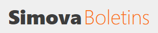
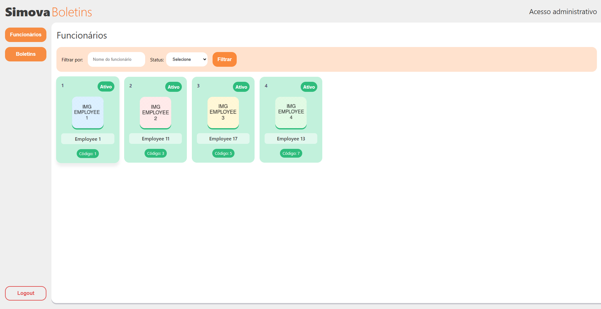
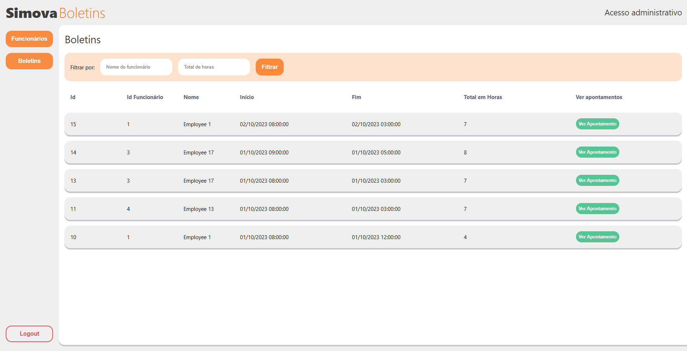
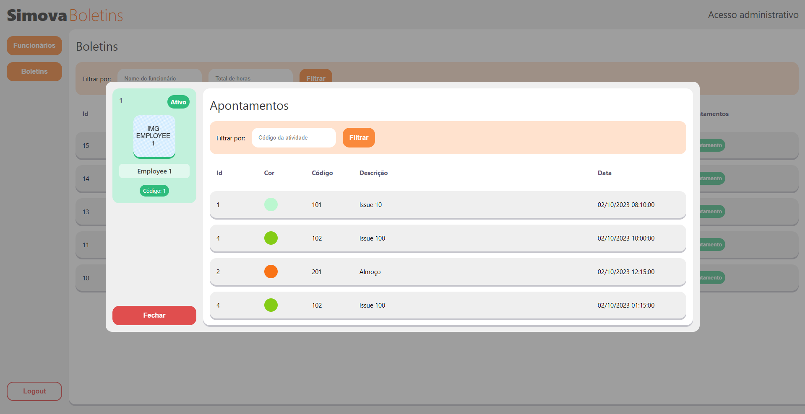

# Simova Boletins - Aplicação

## Objetivo

Aplicação Web para listar boletins de atividades por funcionário

A aplicação está disponível em https://simova-boletins.netlify.app/

## Recursos adicionados

A lista de recursos (features) adicionados são:

- Busca por empregados (Filtro por nome e status);
- Busca por boletins (Filtro por nome e total de horas);
- Busca de apontamentos por boletim (Filtro por código da atividade);

## Arquitetura da aplicação

A arquitetura da aplicação consiste em:

- Frontend: Interface do usuário desenvolvida em VUE;
- Backend: Backend desenvolvido em Javascript e Node.JS;
- Banco de dados: Arquivos JSON gravados dentro de uma pasta ./db no backend.

## Tecnologias utilizadas

A lista de tecnologias utilizadas na aplicação consiste em:

### Frontend

- Vue: Framework para desenvolvimento de aplicação SPA no frontend;
- Vuex: Gerenciador de estados globais para aplicações em Vue;
- Axios: Ferramenta para integração e execução de requisições no frontend;
- Sass: Pré-processador de CSS, para facilitar o desenvolvimento do CSS;
- Vitest: Testes unitários.
- Moment: Conversor de datas;

O frontend está hospedado dentro da Netlify.

### FIGMA

O Design da aplicação está em: https://www.figma.com/design/Ee1bezr0NOwADmvUCTucQO/RECADOS-IO?node-id=0-1&t=YO0Pto01LFVhFKmi-1

### Backend

- Node.JS: Javascript para rodar em servidor;
- Express: Framework para desenvolvimento de aplicações REST API no Node.JS;

O backend está hospedado dentro da Render, onde pode apresentar inconsistências devido a utilização de serviços gratuítos.

## Rotas da aplicação

A aplicação possui as seguintes rotas:

- Login: '/',
- Funcionários: '/employees',
- Funcionários: '/employees/:employeeID/bulletins',
- Boletins: '/bulletins',

## Telas da aplicação

- Login

- Funcionários

- Boletins

- Apontamentos

